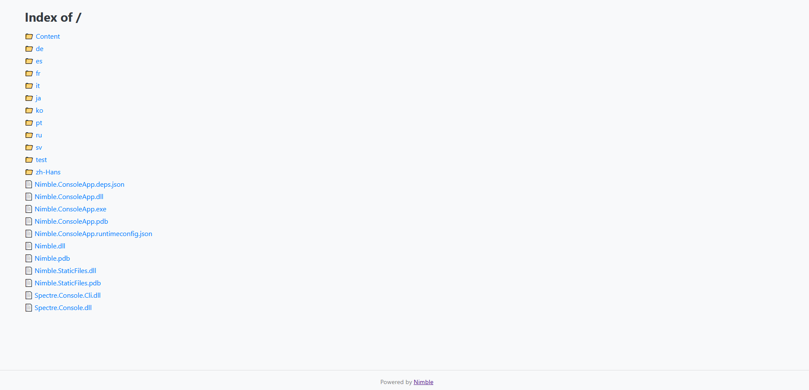

# Nimble.StaticFiles

A lightweight C# library to serve static files using Nimble.

## Installation

Add the project reference to your Nimble HTTP server project:

```bash
dotnet add reference ../Nimble.StaticFiles/Nimble.StaticFiles.csproj
```

---

## Usage

```csharp
using Nimble;
using Nimble.StaticFiles;

var server = new HttpServer("http://localhost:5000/")
    .AddStaticRoute("/static", "./");

await server.RunAsync();
```

Open in browser:

```
http://localhost:5000/static
```

You should now see the static directory listing page:

